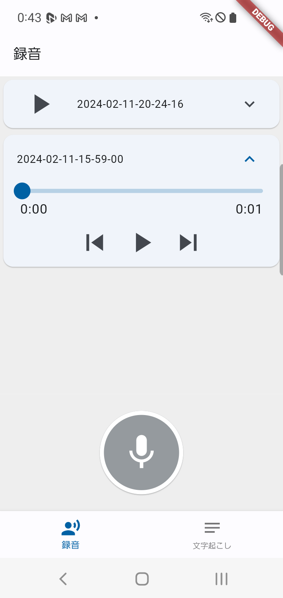
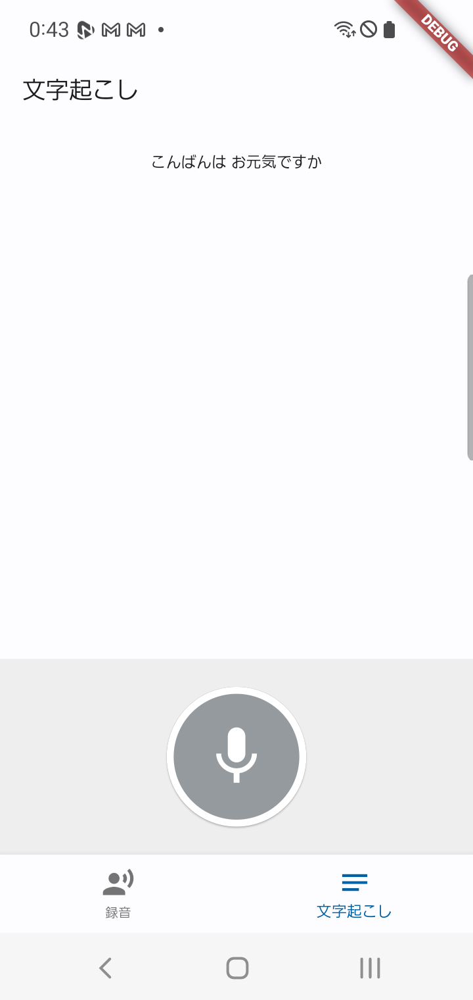

<!-- Improved compatibility of back to top link: See: https://github.com/othneildrew/Best-README-Template/pull/73 -->

<!--
*** Thanks for checking out the Best-README-Template. If you have a suggestion
*** that would make this better, please fork the repo and create a pull request
*** or simply open an issue with the tag "enhancement".
*** Don't forget to give the project a star!
*** Thanks again! Now go create something AMAZING! :D
-->

<!-- PROJECT SHIELDS -->
<!--
*** I'm using markdown "reference style" links for readability.
*** Reference links are enclosed in brackets [ ] instead of parentheses ( ).
*** See the bottom of this document for the declaration of the reference variables
*** for contributors-url, forks-url, etc. This is an optional, concise syntax you may use.
*** https://www.markdownguide.org/basic-syntax/#reference-style-links
-->

<!-- PROJECT LOGO -->
 

  

  <h3 align="center">Voice Recordre  and   Speech Recognition App sample</h3>

<!-- ABOUT THE PROJECT -->
## About The Project

Flutterのライブラリを使って音声録音と音声文字起こしを行う機能のサンプルアプリです。下記のことができます。

・ 音声の録音と再生  
録音ボタンを押して、音声の録音ができます。録音した音声はDBに保存され、後から聴くことも可能です。再生可能な録音アイテムはリストで表示され、再生ボタンを押すことで再生が始まります。

・ 音声の文字起こし  
録音ボタンを押して、話しかけると話しかけた音声が文字起こしされます。録音した音声を文字起こしする機能はありません。

AndroidとiOSで動くと思います。(ただAndroidしか動作確認してません。)
少しずつ機能等を追加するかも。。。

(<a href="#readme-top">back to top</a>)

<!-- GETTING STARTED -->
## Getting Started

本ProjectをgithubからPullし、vscodeなどからlib/main.dartを選択してビルド、実行を行ってください。

